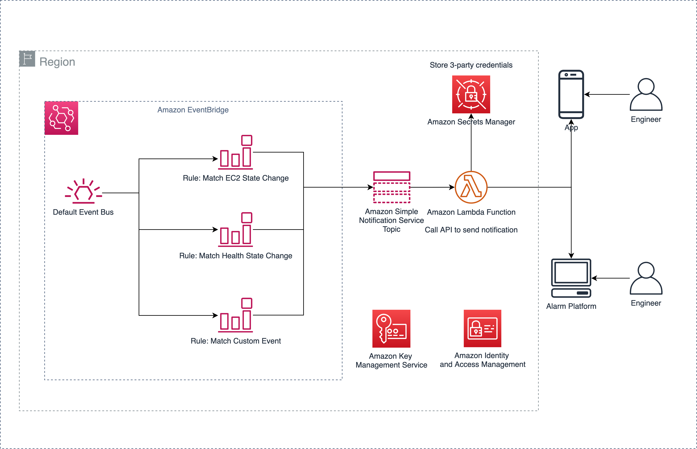

## Solution Description

Serverless Alert Notifier is an one-click serverless solution that help customers send alert notification to common Chinese communication platforms or alert platforms.

The [Amazon CloudFormation][cloudformation] template of this solution will automatically deploy a serverless architecture, including services such as [Amazon EventBridge][eventbridge], [Amazon Simple Notification Service][sns], [Amazon Lambda][lambda], and [Amazon Secrets Manager][secretsmanager] to store credentials required by third-party platforms. You only need to obtain credential information from a third-party platform and store it securely in Amazon Secrets Manager, and the solution will automatically configure the alarm push function.

## Scenarios

This solution uses a series of serverless services to help customers push alert information generated by Amazon Web Services to communication platforms such as WeChat or alarm platforms in a flexible and low-cost way. suitable for monitoring cloud resources. This scenario is suitable for monitoring cloud resources. For example:

- Send notification to operation engineer's wechat when AWS health event happens
- Send notification to devops engineer's wechat when there is a EC2 instance stop
- Send notification to security engineer's wechat when there is security or compliance issue finded by Security Hub
- Send notification to customer's unified alert platform when there is any AWS resource event happens

## Architecture

The solution deploys 2 Amazon EventBridge rules, 1 Amazon Simple Notification Service (SNS) topic and 1 Lambda function, and also used customer pre-configured Amazon Secrets Manager secrets to send alert to apps or alert platforms.

The EventBridge rules are triggered when there are EC2 State Change or Health State Change, then push a message to the SNS topic, which triggers a Lambda function to send message body to alert platforms like WeChat, using credentials in Secrets Manager. Customers can also created new EventBridge rules to monitor other state change of resources.

[cloudformation]: https://www.amazonaws.cn/cloudformation/
[eventbridge]: https://www.amazonaws.cn/eventbridge/
[sns]: https://www.amazonaws.cn/sns/
[lambda]: https://www.amazonaws.cn/lambda/
[secretsmanager]: https://www.amazonaws.cn/secrets-manager/