## 部署前提

### 亚马逊云科技账户

确保您已经拥有激活的亚马逊云科技中国区账户，如果还没有，可以通过 [注册亚马逊云科技中国区][register] 进行注册。

注意：由于需要告警的资源和告警相关的服务与区域有关，所以请先选择您的资源所在的区域，在这个区域中完成部署前提与部署方案。如果您需要为其他区域的资源增加告警功能，可以在其他区域再执行部署前提并部署方案。

### 获取告警推送凭证

1. 登录 [企业微信][enterprise wechat] 。选择您的已有企业（如果还没有企业，可以在企业微信APP中创建一个，不需要进行认证），进入管理页面。

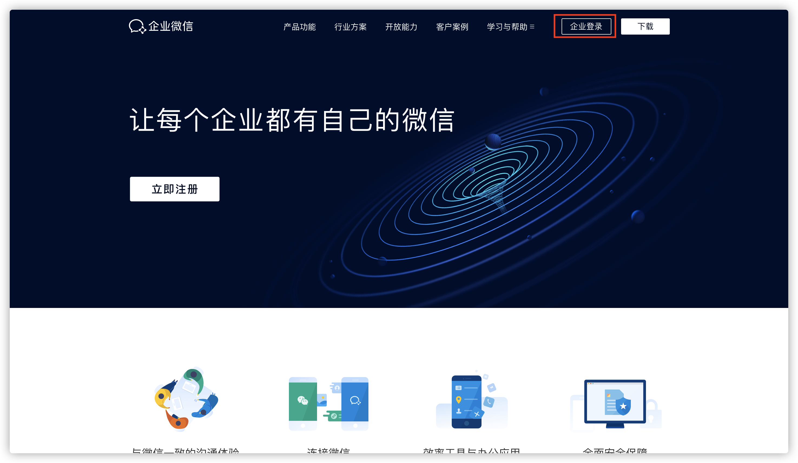

2. 获取微信企业ID。在企业微信中，点击【我的企业】，在企业信息中找到【企业ID】进行复制。

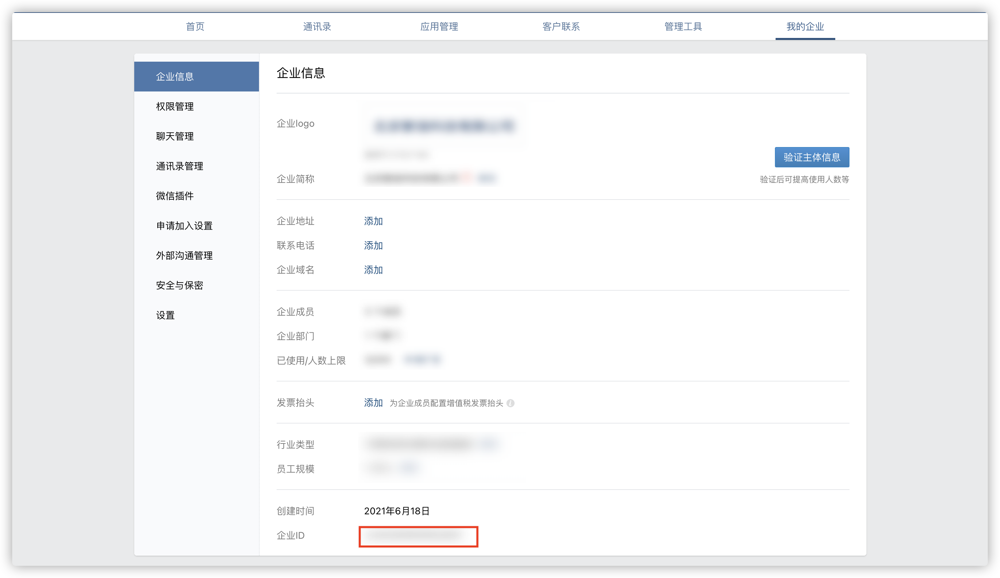

3. 将获取到的企业ID存储在Secrets Manager中。然后打开亚马逊云科技管理控制台，搜索【Secrets Manager】服务，进入服务页面后点击【Store a New Secret】进行创建，密钥类型选择【Other type of secrets】，下方存储类别选择【Plaintext】，将复制的企业ID填入下方的空白输入框中，点击【Next】。在下一步的【Secret Name】中设置密钥的名字（如CORPID），然后一直点击【Next】直到创建成功。记录下Secret ARN留作之后使用。

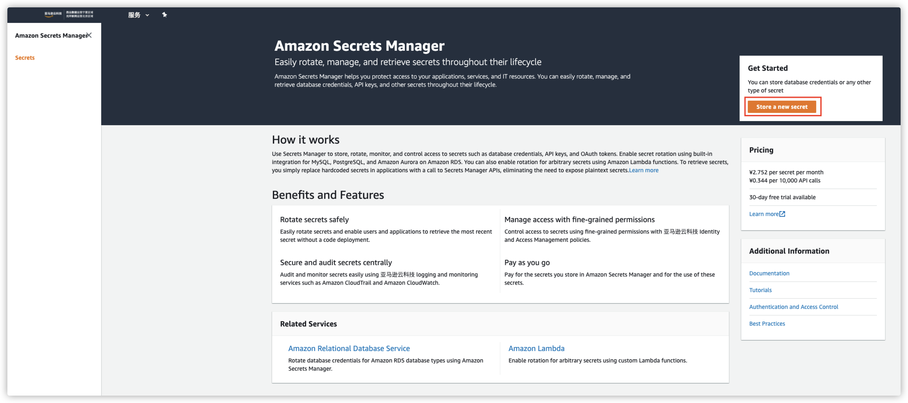
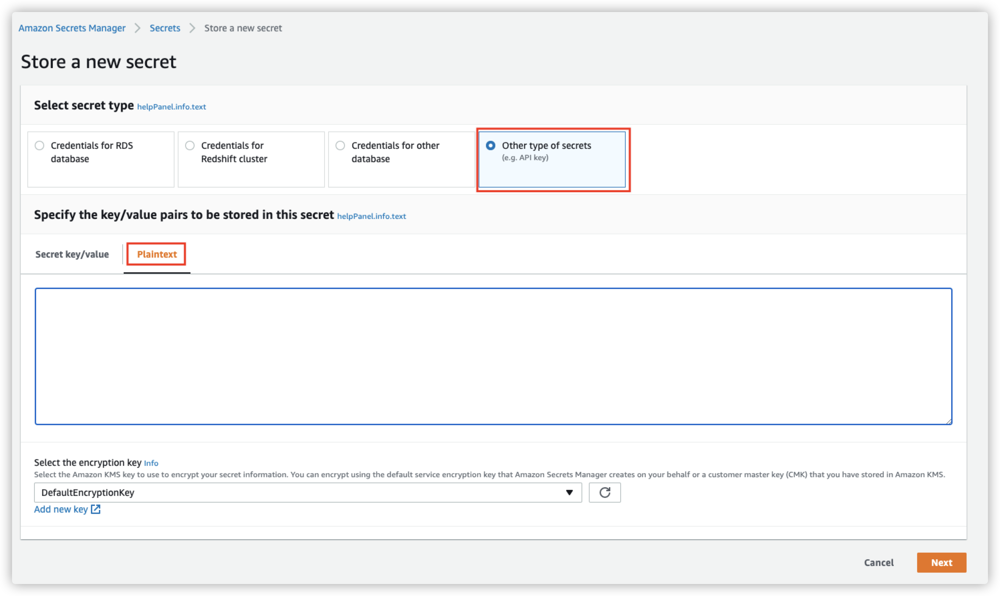
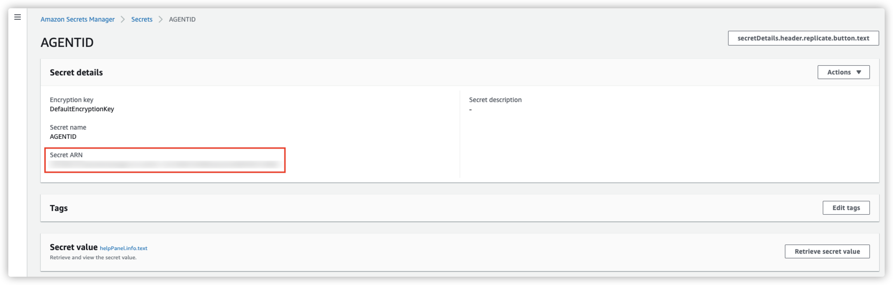

4. 创建告警应用。回到 [企业微信管理页面][enterprise wechat]，点击【应用管理】，在【自建】一栏中点击【创建应用】。填写应用名称并上传应用Logo，在【可见范围】中选择要获得通知的人员名单，之后点击【创建应用】完成创建。

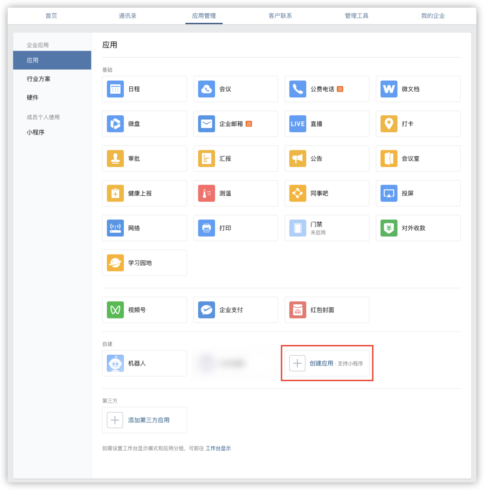
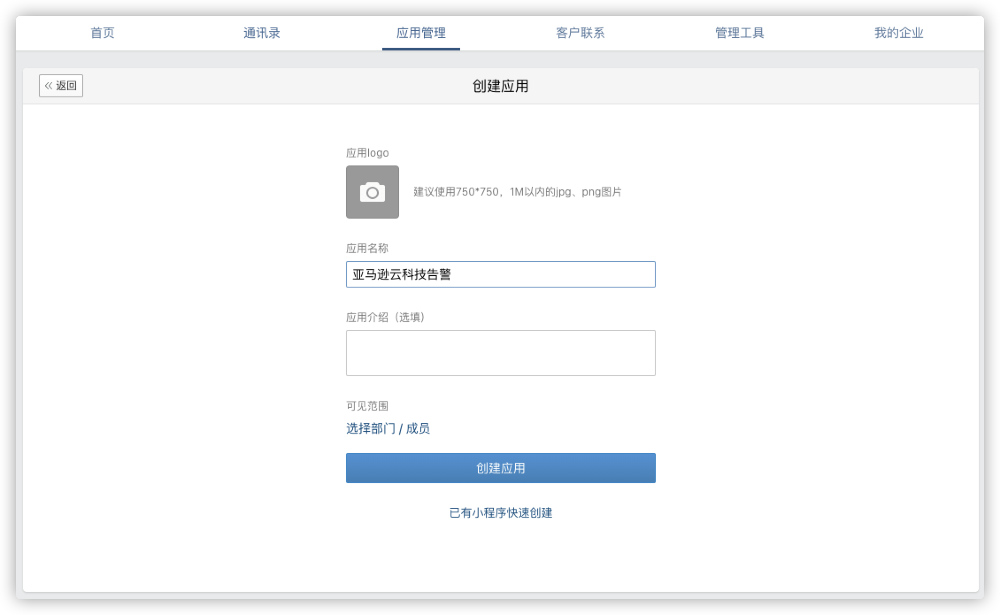

5. 获取应用ID，存储在Secrets Manager中。在创建的应用中复制AgentId 的值，回到亚马逊云平台控制台，参照之前步骤创建另一个Secrets Manager的密钥（如名为AGENTID），并记录它的Secret ARN留作之后使用。

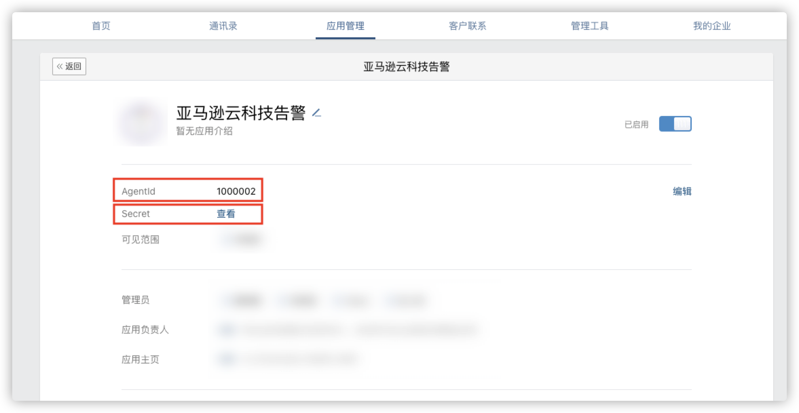

6. 获取应用Secret，存储在Secrets Manager中。同样在刚才打开的企业微信应用页面，点击Secret后面的【查看】，会提示您发送到企业微信中查看。在企业微信APP中复制收到的Secret，参照之前步骤创建一个Secrets Manager的密钥（如名为AGENTSECRET），并记录它的Secret ARN留作之后使用。

### 微信关注您的企业

回到 [企业微信管理页面][enterprise wechat]，在【我的企业】中找到【微信插件】功能，会看到【邀请关注】部分有一个二维码。用您的微信扫描这个二维码，关注企业公众号，之后就可以从微信中收到推送信息了。

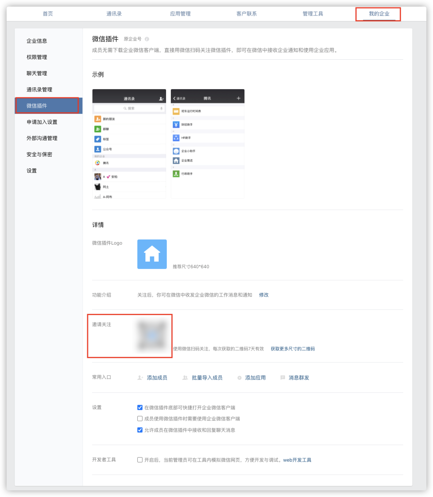

## 部署指南

### 启动 CloudFormation 堆栈

登陆亚马逊云科技管理控制台，选择以下链接进行部署。默认情况下，此模板在您之前使用过的区域部署，您同时可以使用控制台右上方的区域选择链接，以在其他区域部署该方案。
 - [全球区域部署][global deploy]
 - [中国区域部署][china deploy]

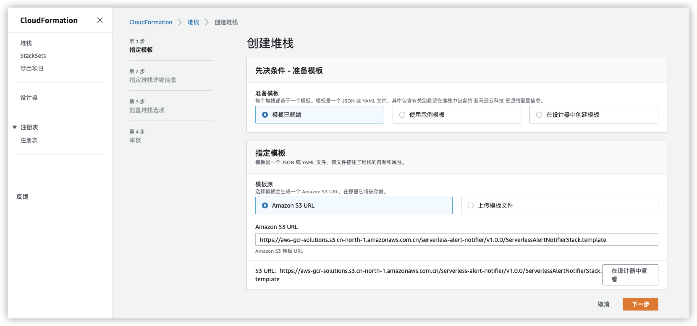

### 指定堆栈详细信息

点击【下一步】，进入参数设置页面，如下图所示。

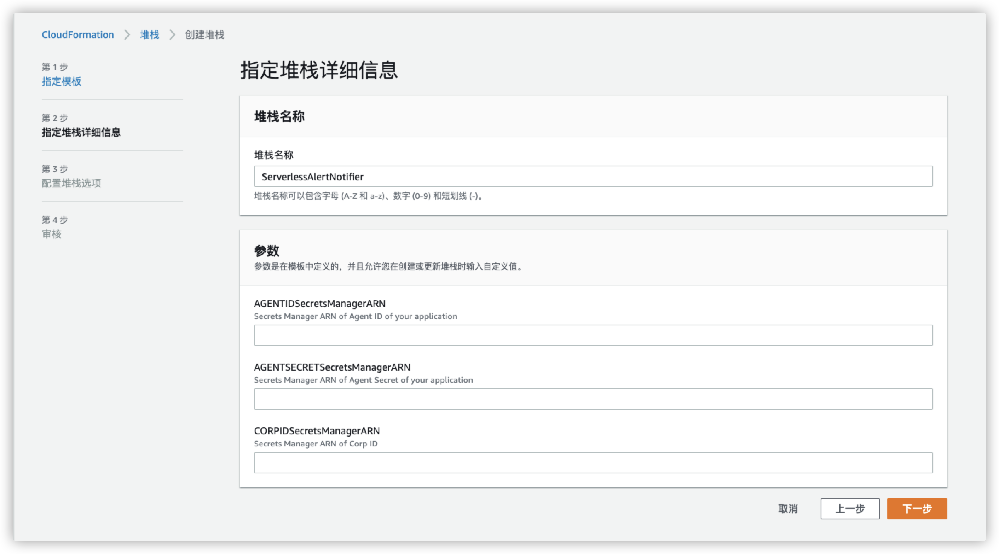

分别填入之前创建的Secrets Manager密钥的Secret ARN值。

    |              参数                 |        值        |              描述             |
    |:--------------------------------:|:----------------:|:------------------------------|
    |  AGENTID Secrets Manager ARN     | String类型，ARN值 |   应用ID存储的Secret ARN值      |
    |  AGENTSECRET Secrets Manager ARN | String类型，ARN值 |   应用Secret存储的Secret ARN值  |
    |  CORPID Secrets Manager ARN      | String类型，ARN值 |   企业ID存储的Secret ARN值      |

填写参数后，点击 【下一步】。

### 配置堆栈选项

保持默认值，点击【下一步】。

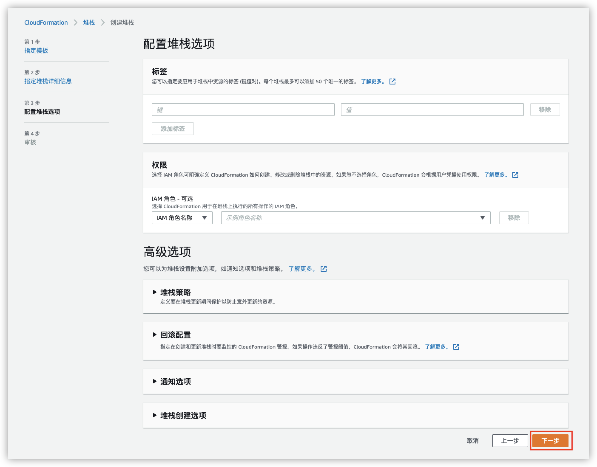

### 审核堆栈

保持默认值，请勾选 “ 我确认，CloudFormation 可能创建具有自定义名称的 IAM 资源。”的单选框，点击 【创建堆栈】。

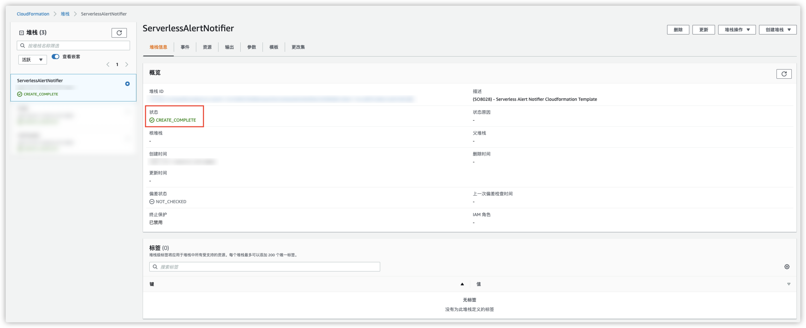

等待大概 2-3分钟，直至堆栈状态为Complete，创建完成。

## 推送测试

部署完成后，您可以通过从SNS发送测试消息，来测试微信是否可以成功接收到告警信息。

在CloudFormation堆栈中，切换到【资源】标签页，点击NotifierTopic 对应的链接，跳转到SNS主题页面。

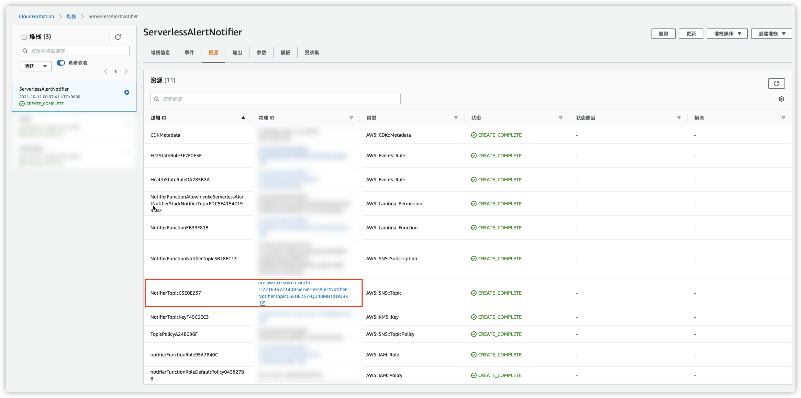

在SNS主题页面，点击右上方的【发布消息】。

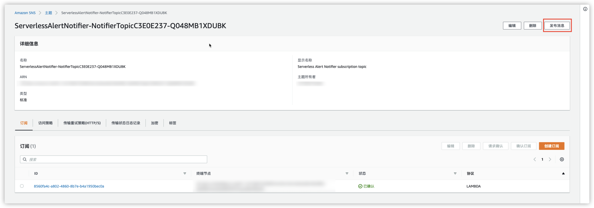

填写主题和消息正文，点击右下方的【发布消息】，就可以将消息发布到SNS主题，自动触发Lambda将消息发送给微信平台。如果之前获取的凭证无误，此时您的微信会提醒您收到一条新消息。

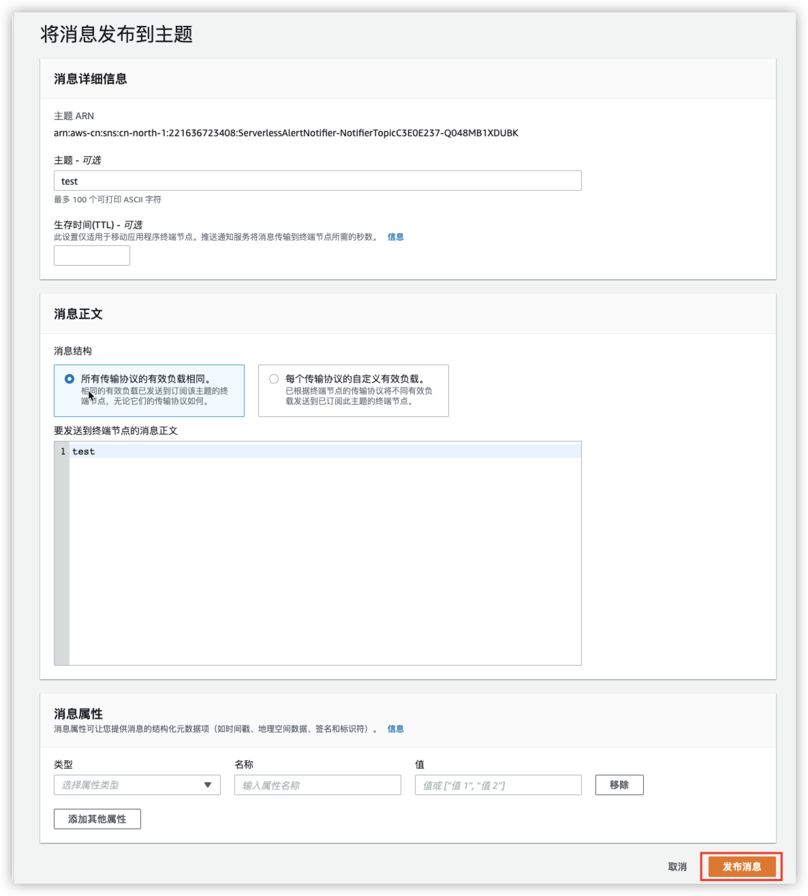

## 告警配置

SNS告警推送测试成功后，您可以启动或停止一台EC2实例，此时应该会收到微信消息，里面的内容是一长串Json格式的文字。您可以在EventBridge中进行简单配置，将这些文字转化为有序的通知信息。

打开亚马逊云科技控制台，选中之前创建的CloudFormation堆栈中，切换到【资源】标签页，点击EC2StateRule对应的链接，跳转到对应的EventBridge服务页面。

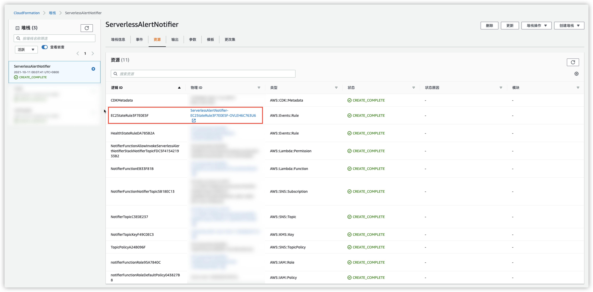

点击右上方的【编辑】按钮，进入规则编辑页面。

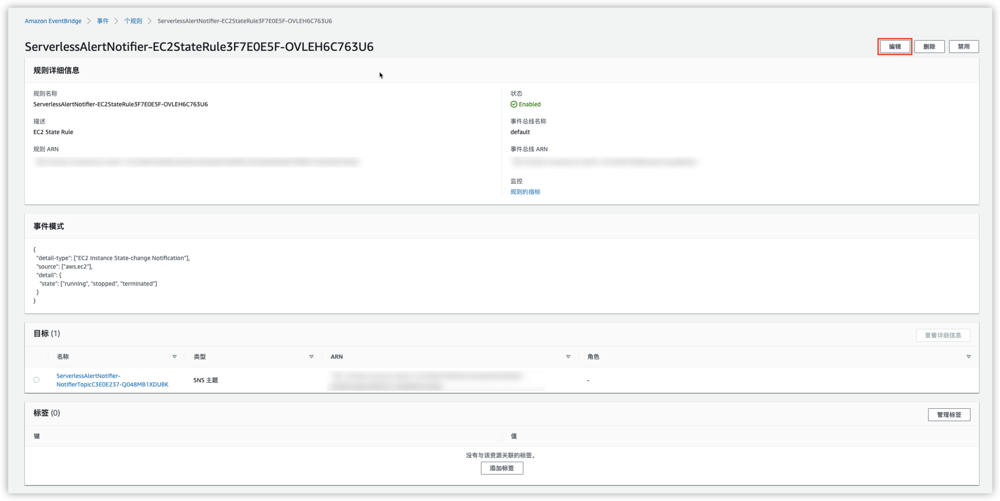

在【选择目标】部分，展开【配置输入】，修改输入方式为【输入转换器】，并在下方的文本框中分别填入以下内容，然后点击【更新】即可。

输入路径：

```
{"instance-id":"$.detail.instance-id","region":"$.region","state":"$.detail.state","time":"$.time"}
```

输入模板：

```
"EC2状态变化告警: \n时间: <time> \n区域: <region> \n实例id: <instance-id> \n状态: <state>"
```

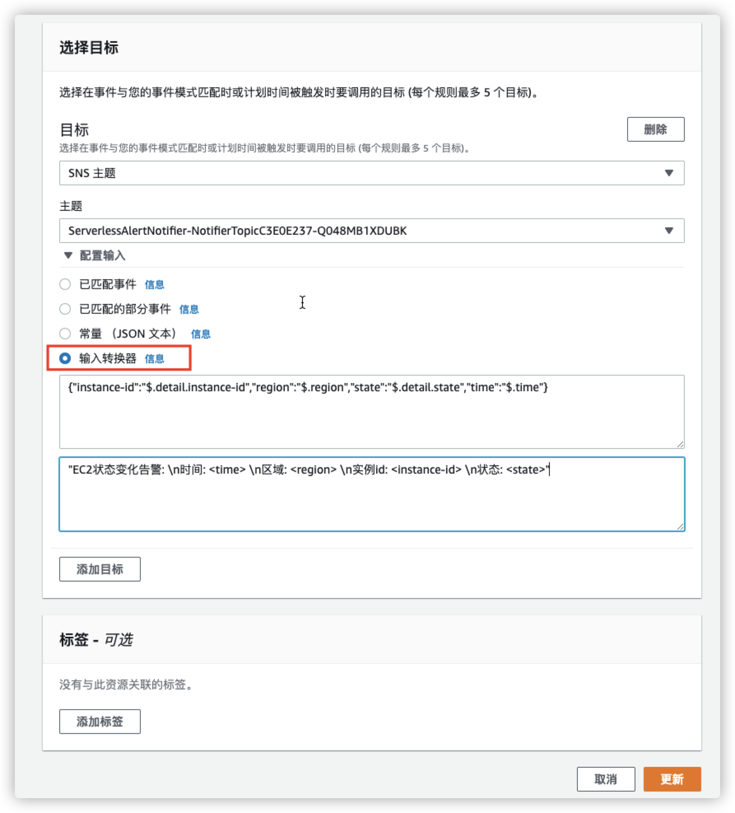

之后再有EC2实例状态变化的时候，您收到的就是格式化的告警信息了。


[register]: https://docs.amazonaws.cn/aws/latest/userguide/accounts-and-credentials.html
[enterprise wechat]: https://work.weixin.qq.com/
[global deploy]: https://ap-southeast-1.console.aws.amazon.com/cloudformation/home?region=ap-southeast-1#/stacks/create/template?stackName=ServerlessAlertNotifier&templateURL=https://aws-gcr-solutions.s3.amazonaws.com/serverless-alert-notifier/v1.0.0/ServerlessAlertNotifierStack.template
[china deploy]: https://console.amazonaws.cn/cloudformation/home?region=cn-north-1#/stacks/create/template?stackName=ServerlessAlertNotifier&templateURL=https://aws-gcr-solutions.s3.cn-north-1.amazonaws.com.cn/serverless-alert-notifier/v1.0.0/ServerlessAlertNotifierStack.template