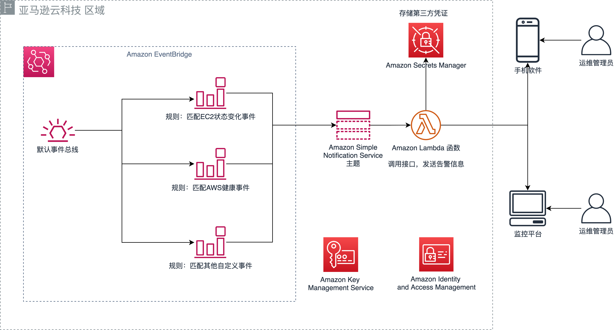

## 背景介绍

亚马逊云科技向客户提供数百种服务，这些服务的状态变化可能是业务管理上的重要信号。这些告警信息默认可以通过邮件的方式发送给客户，但实时性不够高，不如发送到客户常用的通讯平台或统一告警平台。客户需要一种免开发、易使用、低成本的方式，自动推送亚马逊云科技的资源告警信息到客户指定的平台，如微信、钉钉或统一告警平台，从而更方便的获取告警信息，或更集中的查阅告警信息。

## 方案描述

无服务器告警推送器（Serverless Alert Notifier） 是一键部署的告警推送解决方案，帮助客户将亚马逊云科技的资源告警信息推送到客户指定的通知平台。目前方案支持微信，下一步将支持钉钉和其他常用的统一告警平台。

此解决方案的 [Amazon CloudFormation][cloudformation] 模板会自动部署一套无服务器架构，包含 [Amazon EventBridge][eventbridge]、[Amazon Simple Notification Service][sns]、 [Amazon Lambda][lambda] 等服务，以及用 [Amazon Secrets Manager][secretsmanager] 来存储第三方平台需要的凭证。您只需要从第三方平台获取凭证信息，安全存储到Amazon Secrets Manager，方案就会自动配置好告警推送功能。

## 使用场景

此解决方案适用于对亚马逊云科技资源的监控场景，例如：

- 当亚马逊云科技服务中断、API不可用等事件发生时进行告警
- 当Amazon EC2 实例状态改变（新实例启动、有实例停止工作）时进行告警
- 当Amazon Simple Storage Service （S3）中有文件被删除时进行告警
- 当Amazon Elasticsearch 服务的JVM内存或容量达到80%时进行告警
- 当任何用户，或特定用户登录亚马逊云科技控制台时进行告警
- 当Amazon Security Hub发现安全风险和合规问题时进行告警
- 当Amazon EventBridge支持的SaaS合作伙伴，如Auth0、MongoDB等，产生告警消息时进行推送
- 客户自定义的业务指标在特定情况下发出告警

## 系统架构

### 架构图

此解决方案可在由西云数据运营的亚马逊云科技（宁夏）区域或由光环新网运营的亚马逊云科技（北京）区域中部署，也可以在亚马逊云科技海外区域中部署。部署此方案会在亚马逊云科技中构建以下环境。

### 组件

#### Amazon EventBridge
- Amazon EventBridge 事件总线：使用默认的事件总线
- Amazon EventBridge 规则：创建两个默认规则，分别匹配EC2状态变化事件和亚马逊云科技健康事件，作为样例，这样您会在EC2实例状态发生变化（启动、停止、终止等）和亚马逊云科技健康事件发生时收到通知。您也可以自己创建其他自定义事件，来匹配您需要的规则。

#### Amazon Simple Notification Service
- Amazon SNS 主题：创建一个SNS主题，用于接受来自EventBridge的事件，并触发Lambda进行告警推送。

#### Amazon Lambda
- 告警推送函数：用于推送告警信息，以SNS主题作为触发器。

#### Amazon Secrets Manager
- Secrets：存储第三方平台的凭证，让Lambda等服务可以安全地访问这些数据。

[cloudformation]: https://www.amazonaws.cn/cloudformation/
[eventbridge]: https://www.amazonaws.cn/eventbridge/
[sns]: https://www.amazonaws.cn/sns/
[lambda]: https://www.amazonaws.cn/lambda/
[secretsmanager]: https://www.amazonaws.cn/secrets-manager/